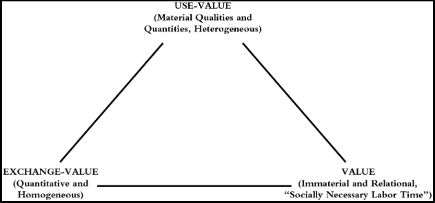
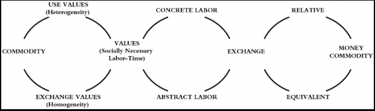

# Chapter 1. Commodities And Exchange

## Section 1: Use-Value and Value

Marx lays out fundamental categories in a priori and cryptic take it or leave it way. The commodity is the beginning point wealth "appears as an immense collection of commands; the individual commodity appears as it's elementary form." Appears occurs twice it signals that something else is going on beneath the surface appearance.

Starting with commodities, turns out to be very useful because everyone has daily contact with an experience of them. The commodity form is a universal presence within a capitalist mode production. Commodities are essential to our existence; we have to buy them in order to live. Commodities are traded in the market. The commodity is something that meets the human need or want or desire. It is something external to us that we take possession of and make ours. Marx is not interested in the nature of these needs. Commodities all of them are different in terms of their material qualities and how they are described quantitatively. The discovery of the manifold uses of things is the work of history as is the invention of socially recognized standards of measurement for the quantities of these useful objects. The usefulness of a thing can be conceptualized as a use-value.

The problem for social science is that we cannot isolate and conduct controlled experiments in laboratory, so we have to use the power of abstraction instead in order to arrive as similar scientific forms of understanding. But in the form of society to be considered here, there are also the material bears of exchange-value when we look at actual exchange processes in the market witness an immense variety of exchange ratios between, apples, and oranges, and these exchange ratio is very a great deal, even for the same products according to time and place.

The idea of an intrinsic value, i.e. an exchange-value that is inseparably connected with the commodity, inherent in it, seems a contradiction in terms. Commodities can keep changing hands and keep moving in a system of exchanges. "The valid exchange-values of a particular commodity expresses something equal, and secondly, exchange-values cannot be anything other than the mode of expression, the form of appearance, of a content distinguishable from it". As the commodity changes hands, it expresses, not only it's qualities, but the qualities of all commodities. Each of them so far as it is exchange-value must therefore be reduced to a third thing.

This common element, Marx argues, cannot be a geometrical, physical chemical or other natural property of commodities. As use-values, commodities differ above in quality, and as exchange-values they can only differ in quantity, and therefore do not contain an atom of use-value. If we don't disregard the use-value of commodities, only one property remains that being products of labor. So commodities are all products of human labor.

He asks what kind of human labor is embodied in commodities? It can't be the actual time taken – what he calls concrete labor – because then the longer taken to produce the commodity, the more valuable it would be he concludes all commodities are reduced to the same kind of labor, human labor in the abstract. What does this human labor in the abstract look like? Commodities are residues of the products of labor. There is nothing left of them in each case, but the same phantom light objectivity; they are merely congealed quantities of homogenous human labor. As crystals of the social substance, which is common to them all, they are values, commodity values” 128.

What incredibly condensed meaning if human labor in the abstract is a phantom like objectivity how can we possibly see it or measure it? We can interpret exchange-value as a necessary mode of expression, or form of appearance, of value 128. The mystery of what makes all commodities exchange is now understood as a world of appearances of this phantom like objectivity call value. exchange-value is a necessary representation of the human labor of embodied in commodities.

What kind of labor is involved in the production of value. How can this value be measured? In the first instance, this plainly has something to do with labor-time. But it cannot be the actual labor-time, because the commodity would be more valuable, the more unskilled, fool, and lazy the worker who produce". So the labor that forms the substance value is equal human labor, the expenditure of identical human labor power. In order to get at what the expenditure of identical human labor power might mean we look at the “total labor power of society, which is manifested in the values of the world of commodities" 129. To speak of the total labor power of society is to invoke a world market. The measure of value is derived out of the whole world of human laboring.
It is on this dynamic, global terrain of exchange relations. That value is being determined in perpetual, we determined. He here again uses the power of abstraction to arrive at the idea of the units of homogenous labor, each of which is the same as any other to the extent that it has the character of a social average unit of labor, power, and access such this allows him to formulate the crucial definition of value as it socially necessary labor-time, which is the labor-time required to produce any use-value under the conditions of production normal forgive society with the average grieve scale and intensity of labor prevalent in that society". He concludes, "what exclusively determines the magnitude of value of any article is, therefore the amount of labor, socially necessary, or the labor-time socially necessary for its production "129. There is your definition.

use-value, exchange, value, and value, come from Riccardo. Ricardo appeal to the concept of labor-time as value. Marx uses the concept of socially necessary labor-time. He replicates the recording, conceptual apparatus and innocently inserts a modification. But this modification makes a world of difference. What is socially necessary? How is that established by who we have no immediate answer, but this question is one thing that runs through the who what are the social necessities embedded within a capitalist mode of production?
Marx is arguing that there is a certain kind of matter of value, which is being determined by process that we do not understand, and which is not necessarily our conscious choice. If you think you can solve a series, environmental question, like a little warming without actually confronting the question of by whom and how the foundational value structure of our society is being determined, than you are kidding yourself. Commodity values are not fixed magnitude. They are sensitive, to changes in productivity:
"The introduction of power glooms into England, for example, probably reduced by 1/2 the labor required to convert a given quantity of yarn into woven fabric. In order to do this, the English hand Weaver in fact needed the same amount of labor-time as before; but the product of his individual hour of labor, not only represented half an hour of sofa labor and consequently fell to 1/2. It's for value. 129.”

Was sensitive to revolutions in technology and productivity much of volume one is going to be taken up with the discussion of the origins and impacts of revolution and productivity, and the consequence revolutions in value relations value is determined by a wide range of circumstances; it is determined amongst other things by the workers average degree of skill, the level of development of science and it's technological application. The social organization of the process of production, the extent and effectiveness of the mean to production, and the conditions found in the natural environment. 130.

You think can be a use-value without being a value. Also, it can be useful, and a product of human labor, without being a command. But the implications of this is that nothing can be a value without being an object of utility if the thing is useless, so is the labor contained in it; the labor does not count his labor and therefore creates no value. 131. Let us reflect for a moment on the structure of this argument. We begin with the singular concept of the commodity and establish its dual character. It has a use-value and an exchange-value. exchange-values are representations of something. Representation of value. And value is socially necessary, labor-time. Value doesn't mean anything unless it connects back to use-value. use-value is socially necessary to value. The pattern to this argument looks something like this:

Consider the implications of this argument you want a commodity called the house. Are you more interested in use-value or its exchange-value? You will likely be interested in both. But if you want to fully realize the exchange-value, you have to surrender it use-value to someone else. If you have the use-value of it, but it is difficult to get access to the exchange-value. The commodity is a unity. But within that unity, there's a dual aspect, the dual aspect allows us to define something called value as socially necessary, labor time, if the supplies, the exchange-value will go down; with the supplies is too little, the exchange-value will go up – so there is an element here of supplying demand involved in the accidental and relative aspects of value.

Marx it's not terribly interested in supplying demand relation, he wants to know how to interpret commodity exchange ratios. Can you talk about exchange-value without talking about use-value? No, you can't. Can you talk about value without talking about use-value? No. In other words, you can't talk about any of these concepts without talking about the others. The concepts are codependent on one another relations with a totality of some sort. Marx certainly have the ambition to understand the capital mode production as a totality, so the only question of interest is, exactly what concept of totality does he have in mind? Totality can best be approached through a triumvirate  of concepts, use-value, exchange-value, and value built around the commodity.

Summary:
The story so far is roughly this: he declares that his aim is to uncover the rule of operation of a capital mode production. He starts with the concept of the commodity and immediately establishes dual character: use-value and exchange-value. Since use-values have been around forever, they tell us about the specificity of capitalism so he puts them aside in order to study exchange-values. The exchange ratios between commodities at first appear accidental, but the very act of exchange presupposes that all commodities have something in common that makes them comparable and commensurable. This commonality, he cryptically asserts is that they are all products of human labor. As such the incorporate "value", initially defined as the socially necessary, average labor time necessary to produce them under given conditions of labor productivity. But in order for the labor to be socially necessary, somebody somewhere must want, need or desire of the commodity, which means that the use-values have to be re-integrated into the argument.
In the analysis that follows, these three concepts of use-value, exchange, value and value are kept in perpetual and sometimes tense relationship with one another. He rarely takes any one of these concepts and isolation, it is the relations between them that matter. He does, however, frequently examine the relationship between just two of them while holding the third tactically to one side. And expanding on the dual character of labor and embodied in the commodity in section 2, he focuses on the relationship between the use-value of laboring, and the value that this useful labor and bodies holding exchange-value constant. In the following section brackets, use-value and examines a relationship between exchange-value and value in order to explain the origin role of money. It's important to notice these changes of focus as the argument unfold because the statements in one section are always contingent on which of the concepts is being set aside.
What kind of human labor is socially necessary? The search for an answer reveals another duality, that between the concrete/actual and abstract/social relevant labor. These two forms of labor converge again in the unitary act of commodity exchange. Examination of this moment of exchange reveals another duality between relative and equivalent forms of value. These two amounts of expression of value are reunited in the emergence of one commodity-the money commodity – which functions as a universal equivalent in relation to all other commodities.

Because there is no final moment of synthesis only temporary moment of unity within which yet another contradiction a duality is internalized and then requires a further expansion of the argument. If it is to be understood this is how Marx process of representation unfolds in Capital.

## Section 2: The Dual Character of the Labour Embodied in Commodities
