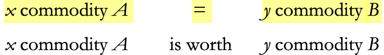
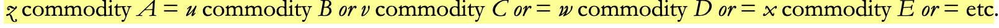
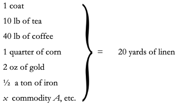
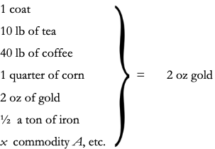

# Chapter 1. Commodities

## 1: The two factors of a commodity:  Use-value and Value (the substance of value in the magnitude value)

### 1.1: Why I start with the commodity

Marx's quote to himself from "a contribution to a critique of political economy", "the wealth of societies in which the capitalist motive production prevails appears as an immense collection of commodities (appears equals takes the form of) the commodity is its elementary form. Why? In the second Germany edition Marx's discussed that of the presentation must differ from its inquiry if done right it will appear as apriori construction. In what does this method of inquiry exist? In Grundrisse (pg 100) Marx says: "starting with a chaotic conception of the whole ... By means of further determination, move analytically towards evermore simple concepts, from the imagined concrete towards ever thinner, abstractions until ... arriving at the simplest determinations ... them from their the journey would have to be retraced." Marx describes his method is moving from the abstract to the concrete, abstract for Marx means not a apriori/arbitrary, but "below "the surface. To not be constructed, but identified. Through method of abstraction (less to more fundamental). Once's this is done we can add secondary determinations. "So if we can see the passage from empirically observed chaotic phenomenon to the simplest determinations, and that from its simplest determinations to the phenomena, now as a rich totality, as two links in a chain, then it is crucial to understanding the method of capital to graph that it is this second link which forms the key to it structure. We are at this stage of exposition simply not privy to the process of investigation – of abstraction – that has proceeded."
Marx's Grundrisse starts from material production/general production (Grundrisse pg 83-5) and conclude with what will be the opening line of capital: "the first category in which bourgeois wealthpresent itself is that of the commodity. (Grundrisse pg 881)". Capital starts with the simplest motive production – abstract labour as a substance value – as the starting point from which additional determinations are layered. This bill to picture of bourgeois society as a rich totality of many determinations and relations.

### 1.2: The use–value of the commodity

if we have to start with the commodity, then we have to define it. Marx defines it as an external object which satisfies human need, desire, or want. The property of this "usefulness" is use-value. Marx claims "usefulness" wise and it's physical properties. Use-value is "only in the use or consumption (Capital PG 126)." While use-value's properties or physical it is also social. It's property exist in relation to human needs. Some also require a level of social/historical development (silicone). If use-value is intrinsic, it is to the extent that it represents a potential.
"use-values," Marx concludes, "constitute the material content of wealth. Whatever it's social form may be (Capital Pg 126). We should not hear the opposition between 'material' and 'social'. Use-value, the property of usefulness or things that bear this property constitute "wealth": the level nature of the wealth of a given society at a given time is given by the nature and quantity of useful things available to it. Wealth in this sense, i.e. use-value, is material: it exist as such independently of the social conditions of its production and consumption. A shoe is a shoe, and it exists and functions as a shoe independently of the social relations under which it is produced and consumed."

## 1.2: the commodities exchange-value

But where the "capitalist motive, production prevails" use-values are also "the material bearers of exchange value”. Since it is precisely the use value, which is the material bearer of exchange value, the latter intrinsic, as a property of the commodity. Mark's observes that certain quantities of commodities a will add a given point in time and given circumstances, "naturally" exchange for X quantity of commodity B, Y quantity of commodity C, Z quantity of commodity D this tells us that commodity a has at least three distinct exchange values at the same time, each of it's listed exchange values are mutually interchangeable the given quantity that one commodity exchanges for a (different) given quantity of another means that a common element of equal magnitude exist in the two different quantities of the two commodities – that each of the commodities in their given quantities are equivalent to, and therefore reduce to a comma third thing which is in itself, neither one nor the other. What then is that third thing? It cannot be a natural aspect. Disregarding qualitative use value, the only thing that is left is the fact that the command is a product of human labour. As abstract human labor, the simple expenditure of physical and mental human labor, and producing something. Commodities are, considered, like this, strip of their use value, nothing more than "congealed" or "crystallized" human labour, measured in time. As congealed labour-time, we can now consider them as values.

### 1.3 Value: its substance, magnitude and form of appearance

Exchange-value as the mode of expression, the "form of appearance", of: "the common factor in the exchange relation, or in the exchange-value of the commodity, is therefore its value." The author asked us to look closely at value itself, independently of its form of appearance.
What is the magnitude of value? It's the labor contained in the article: abstract, labor, measured units of time. If this is the case, that the value of a commodity is determined by the amount of labor time, accumulatively, then why is it not the case that the more labor expanded on the commodity the more value it would have? What Marx reasons is this. The substance of value is the expenditure of human labor, power, independent of form of its expenditure. The total labor power available to society, manifested in the world of commodities, counts as one homogenous mass. It is a labor time required to produce the commodity that forms the substance of its value. This lead us to the following important definition “what exclusively determines the magnitude of the value of any article is therefore the amount of labor, socially necessary or the labor time socially necessary for its production." The value of a commodity will vary with the quantity of socially necessary labor, realized, and its production, but inversely to the productivity of labor realized in its production. Value is therefore not the same as material wealth.

Marx closes this section with two definitions:
First, in regards to the commodity:
"The thing can be a use-value without being a value. This is the case whenever it's utility to man is not mediated through labor. Air, virgin soil, natural meadows, unplanted forest, etc. Fall into this category. A thing can be useful, and the product of human labor, without being a commodity. He who satisfies his own need with the product of his own labor, admittedly, creates use values, but not commodities. In order to produce the latter, he must not only produce use-values, but use-values for others, social use-values. Finally, nothing can be a value without being an object of utility. If the thing is useless, so is the labor contained in it; the labor does not count as labor, and therefore create no value."
Second, regarding value itself: "now we know the substance of value. It is labor. We know the measure of its magnitude. It is labor-time. The form, which stamps value as exchange-value, remains to be analyzed”.

## 2: The twofold character of the labour embodied in commodities

Just as the commodity has a dual character so does labor we shall first consider labor from the useful point of view, before looking at it as it's represented in value.

### 2.1 Useful labour

Two commodities confront each other: a coat, and 10 yards of linen. We assume that the value of the coat is twice that of linen, such that if 10 yards of linen=W, the coat=2W.
As use-values the coat and linen confront each other as qualitatively different; equally, the two types of useful labor do so as well. The existence of a heterogeneous mass of useful labor – a certain level of development of the social division of labor – is a precondition of commodity production. Commodity exchange and therefore production is premise on a certain level of development of the social division of labor, the specialization of labor.

Nonetheless, while a division of labor is a necessary precondition of commodity production, it is not so for the production of use values. For this ladder, what is indispensable is labor itself:
"Men made clothes for thousands of years, under the compulsion of the need for clothing, without a single man ever becoming a tailor. But the existence of coats, of linen, of every element of material wealth, not provided in advanced by nature, had always to be mediated through a specific productive activity appropriate to its purpose, a productive activity that assimilated particular natural materials to particular human requirements. Labor, then, as the creator of use values, as useful labor, as a condition of human existence, which is independent of all forms of society: it is the eternal natural necessity which mediates the metabolism between man and nature, and therefore human life itself (Capital PG 133).”
"When man engages in production, he can only proceed as nature does herself, i.e. he can only exchange the form of materials (Capital PG 133).”

### 2.2 'Value-producing' labour

The coat and the linen confront each other as values: that one coat equals 10 yards of line expresses a quantitative difference. This means they confront each other as qualitative equals: as we have seen products of equal, homogenous labor. They are the expenditure of human labor-power, and it is this better qualitatively distinct use-values to confront each other as qualitative equals. It is not something that pertains to the commodities themselves, but something social: social labor.

Mark's introduces the concept of "simple labor-power": “labor-power possessed in his bodily organism by every ordinary man”. The coat and linen are values if abstracted from their use-values; the labor that produces them as represented by their values if abstracted from its useful purpose. But coats and linen do not confront each other as values, but as values of a certain magnitude. If the productivity of these labors doubles, then one coat will be worth half of what one was worth before, since only half the labor time will be necessary to produce it. The effect is reversed if productivity falls. And increase in the quantity of use-values produce signifies, increase in material wealth produced, but it does not follow that an increase in material wealth cannot correspond to fall in the magnitude of value produced. That this is the case arises from the dual character of labor: "productivity" pertains to useful, concrete labor. "In reality this productivity determines only the degree of effectiveness of productive activity directed towards a given purpose within a given period of time."
The dual character of labor does not signify two different types of labor. "It follows from the proceeding, not that there are two differing kinds of labor working in the commodity, but rather that the same labor is specified and differing, and even contradictory manner – in accordance with whether it is related to the use-value of the commodity as laborers, product or related to the commodity – values as it's merely objective expression just as the commodity must be above all else, an object of use in order to be a value, just so does labor have to be before all else useful labor – purposeful, productive activity – in order to count as expenditure of human labor-power, and hence a simple human labor"

Marx summarises:
“On the one hand, all labor is an expenditure of human labor – power and the physiological sense, and it is in this quality of being equal to human labor, or abstract, human labor, that it forms the value of commodities. On the one hand, all labor is an expenditure of human labor-power in a particular form and with a definitive theme and it is in this quality of being concrete useful labor that it produces use–values.”

## 3: The form of value or exchange value

(The purpose of this section (3) is to show how and why the money form comes to exist)

A commodity has a dual form: a bodily form, and a value form. The substance of the value of the community, the abstract, human labor, and its magnitude the quantity of abstract, social necessary labor for its production: what is the form of its value?

Commodities possess the character of values only and so far as they are expressions of a "identical, social substance, human labor, their character as values thus a social character in exchange. The substance of the value of the commodity is abstract, human labor, its magnitude the quantity of abstract labor, socially necessary for its production. It is not adequate to say that the value of commodity is X units of social, we necessary, labor, since labor is not the measure of value, it is value: the value of a certain quantity of commodity a equals X units of socially necessary labor is the same as saying that the value of a certain quantity of commodity a equals, the value of a certain quantity of commodity a and we have resolved nothing.

What Marx argues is this. A commodity is at the same time both a use value, and a value. Value is a quantitative property that commodities share in common. Commodities can exist as values only to the extent that they are composed of this common, social substance, human labor, and that, therefore, value itself is a social phenomena that, despite its objective existence, only manifest itself in the social exchange of commodities. Commodity a as a commodity will never be exchanged for itself, but always for another commodity. Value can only be expressed, can only be ascertained, can only manifest itself, when a commodity enters into an exchange relation with another commodity.

"Not an atom of matter, enters into the objectivity of commodities as values; in this it is the direct opposite of the course we sent objectivity of commodities as physical objects. We may twist and turn a single commodity as we wish; it is impossible to grasp it as a thing possessing value. However, let us remember that commodities is possess an objective character. They value only in so far as they are all expressed of an identical, social substance, human that the objective character as values is therefore purely social. From this it follows self – evidently that it can only appear in the social relation between commodity and commodity. (Capital 138-9)”

The aim will be “to perform a task, never even attempted by bourgeois economics ”: “to show the origin of the money form (Capital 139)”. What Marx will do, through examining the exchange relations of commodities in increasingly complex forms, will be to identify the logical necessity of money.

### 3.A The simple, isolated, or accidental form of value

### 3.A.1 The Two Poles of the Expression of value

First, we considered the simplest possible form of commodity exchange, the exchange of one commodity for another i.e. barter. The coat and the linen not only fulfill different roles in the relation, their roles are mutually exclusive, even though at the same time they belong to and mutually conditioned each other. Because the rules of these two commodities are different, they must have different use values: one cannot express the value of commodity in itself, only in another commodity. Because the rules of commodities are different the equation is reversible, but not symmetrical.

### 3.A.2 The relative form of value

#### 3.A.2.i The [qualitative] content of the relative form of value

#### 3.A.2.ii The quantitative determinacy of the relative form of value

#### 3.A.2.iii the equivalent form

#### 3.A.2.1 The Three Peculiarities

1. First Peculiarity:
2. Second Peculiarity:
3. Third Peculiarity:

#### 3.A.2.iv The simple form of value considered as a whole

### 3.B The total or expanded form of value

20 yards of linen = 1 coat || 20 yards of linen = 10 lbs of tea || 20 yards of linen = 2 oz gold || ...

#### 3.B.1 The expanded relative form of value

#### 3.B.2 The particular equivalent form

#### 3.B.3 Defects of the total or expanded form of value

### 3.C The general form of value

#### 3.C.1 The changed character of the form of value

#### 3.C.2 The development of the relative and equivalent forms of value: their interdependence

#### 3.C.3 The transition from the general form of value to the money form

### 3.D The money form

## 4: The fetishistic character of the commodity and its secret

### 4.1 In what does the mysteriousness of the commodity consist

### 4.2 From where does the mysteriousness of the commodity come from

### 4.3 The limits of political economy
